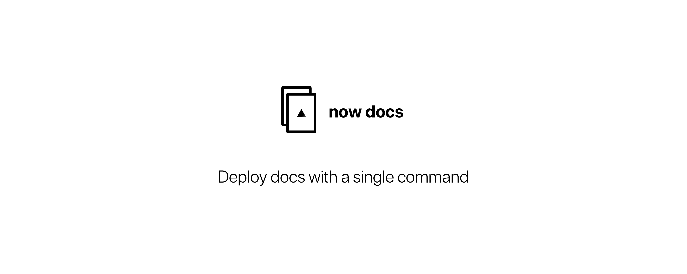

Deploy docs with a single command using [now](https://github.com/zeit/now-cli).

[](https://travis-ci.org/bukinoshita/now-docs)
[](https://github.com/sindresorhus/xo)
[](https://github.com/prettier/prettier)


## Install

```bash
$ npm install -g now-docs
```


## Usage

```bash
$ now-docs --help

  Usage:
    $ docs                      Deploy `now-docs`

  Options:
    -h, --help                  Show help options
    -v, --version               Show version
```


## Related

* [zeit/now](https://github.com/zeit/now-cli) — Universal serverless
  single-command deployment
* [now-domains](https://github.com/bukinoshita/now-domains) — Check
  now domains availability and pricing
* [now-domains-status](https://github.com/bukinoshita/now-domains-status)
  — Check now domains availability
* [now-domains-price](https://github.com/bukinoshita/now-domains-price)
  — Check now domains price
* [netlify-docs](https://github.com/bukinoshita/netlify-docs) — Deploy docs with a single command using Netlify

## Comparing `now-docs` with `netlify-docs`

Check comparison [here](https://latency.apex.sh/?url=https%3A%2F%2Fnow-docs.now.sh%2F&compare=http%3A%2F%2Fnetlify-docs.netlify.com%2F).


## License

MIT © [Bu Kinoshita](https://bukinoshita.io)
